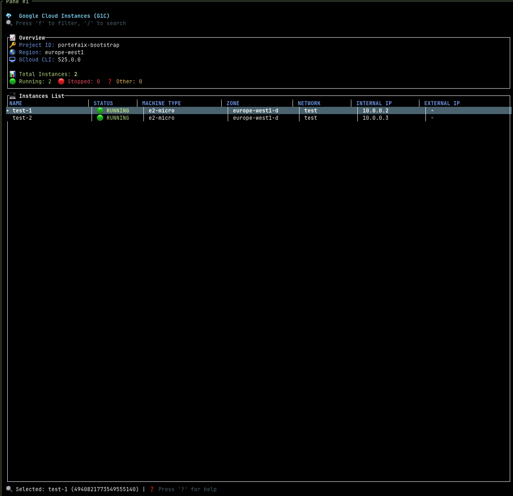

# g1c - Google Cloud Instances Terminal UI Manager

[](https://github.com/nlamirault/g1c/releases)
[](https://github.com/nlamirault/g1c/blob/main/LICENSE)
[](https://scorecard.dev/viewer/?uri=github.com/nlamirault/g1c)
[](https://bestpractices.coreinfrastructure.org/projects/10711)

A terminal user interface for monitoring and managing Google Cloud Instances, inspired by
[k9s](https://github.com/derailed/k9s) for Kubernetes, [e1s](https://github.com/keidarcy/e1s) for AWS EC2.



## Features

- 🖥️ Real-time monitoring of Google Cloud VM instances
- 🔍 Filter and search instances by various attributes
- ⚡ Perform common operations (start, stop, restart, etc.)
- 🔄 Auto-refresh with configurable intervals
- 🌍 Support for multiple projects and regions
- 🔐 Authentication using Google Cloud credentials
- 🎨 Customizable UI with different color themes

## Prerequisites

- Rust and Cargo installed (version 1.75.0 or higher recommended)
- Google Cloud SDK (gcloud CLI) installed and configured
- Active Google Cloud account with appropriate permissions
- A Google Cloud project with Compute Engine API enabled

## Installation

### From Source

```bash
# Clone the repository
git clone https://github.com/nlamirault/g1c.git
cd g1c

# Build and install
make install
```

### Using Cargo

```bash
cargo install g1c
```

## Usage

```bash
# View instances from default configured project
g1c

# View instances from a specific project
g1c --project my-project-id

# View instances from a specific region
g1c --region us-central1   # or -g us-central1

# View instances with refresh interval of 5 seconds
g1c --refresh 5   # or -r 5
```

### Using Make

The project includes a Makefile for common operations:

```bash
# Build the project
make build

# Run the application
make run

# Build release version
make release

# Install the application
make install

# Check environment
make check-env

# Show help
make help
```

## Keyboard Shortcuts

| Key                | Action                    |
| ------------------ | ------------------------- |
| `q`, `Ctrl+c`      | Quit                      |
| `?`                | Show help                 |
| `↑`, `↓`, `j`, `k` | Navigate up/down          |
| `Enter`            | Show instance details     |
| `f`                | Filter instances          |
| `r`                | Refresh data              |
| `s`                | Start instance            |
| `S`                | Stop instance             |
| `R`                | Restart instance          |
| `d`                | Delete instance           |
| `/`                | Search                    |
| `ESC`              | Close popup/cancel action |

## Configuration

g1c will look for configuration in the following locations:

1. Command line arguments
2. Environment variables
3. Configuration file at `~/.config/g1c/config.toml`

Example configuration file:

```toml
default_project = "my-project-id"
default_region = "us-central1"
refresh_interval = 3 # seconds
theme = "dark"
```

## Authentication

g1c uses the standard Google Cloud authentication methods through the gcloud CLI. Make sure you have:

1. Google Cloud SDK installed and configured
2. Authenticated with `gcloud auth login`
3. Set a default project with `gcloud config set project PROJECT_ID` or use the `--project` flag

You can check your authentication status with:

```bash
make check-env
```

## Development

### Requirements

- Rust 1.75.0 or higher
- Google Cloud SDK

### Building

```bash
# Check code
make check

# Format code
make fmt

# Run linter
make lint

# Run tests
make test

# Generate documentation
make docs
```

## Contributing

Contributions are welcome! Please feel free to submit a Pull Request.

## License

Apache Version 2.0
